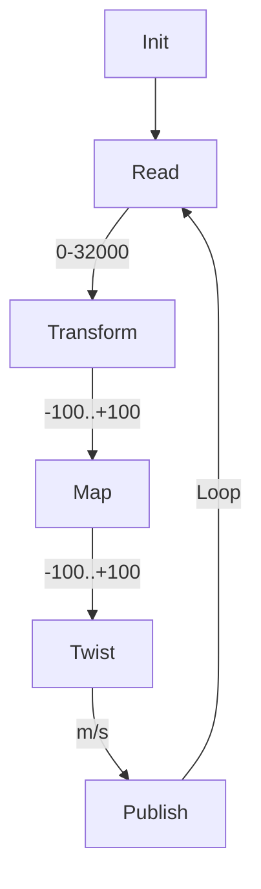

# ROS2 Python Joystick controller

Remotely control your robot via cmd_vel topic \
**Input:** 3x axis analog joystick (X + Y + Z/Twist) \
**Output:** micro-ROS node (ROS2) that publish topic /cmd_vel with msg.type twist_stamped
* Angular = X-axis = Pull stick Left/Right
* Linear  = Y-axis = Pull stick Up/Down
* Twist   = Z-axis = Turn/Twist stick  (Not used right now)

## Behaviour
1. Once: Read/Set all the parameters
1. Repeatedly: Read analog joystick via ADC
1. Repeatedly: Transform indata to a +/-100% values
1. Repeatedly: Map where the stick are => Depending om location, then adjust behivaiur.
1. Repeatedly: Transform X, Y movment into Linear & Angaular according to twist msg.type
1. Repeatedly: Publish ros-topic



## Prerequisite: Hardware
* A/D converter: KY-053 Analog Digital Converter (ADS1115, 16-bit) via default I2C adr.=0x48
* Joystick: 3x analog 10K resistors. X-, Y- and Twist-axis.
* Single Board Computer(SBC): Raspberry Pi 4

## Prerequisite: Software
* Robot Operating System 2, ROS2 (Version Galathic) \
  >...do the ROS2-installation stuff...

## Prerequisite: I2C-interface Raspberry Pi 4 / Ubuntu
```Shell
~$ sudo apt install i2c-tools
~$ sudo apt install python3-pip
~$ sudo pip3 install smbus2
~$ sudo pip3 install adafruit-ads1x15
~$ sudo i2cdetect -y 1
        0  1  2  3  4  5  6  7  8  9  a  b  c  d  e  f
   00:          -- -- -- -- -- -- -- -- -- -- -- -- -- 
   10: -- -- -- -- -- -- -- -- -- -- -- -- -- -- -- -- 
   20: -- -- -- -- -- -- -- -- -- -- -- -- -- -- -- -- 
   30: -- -- -- -- -- -- -- -- -- -- -- -- -- -- -- -- 
   40: -- -- -- -- -- -- -- -- 48 -- -- -- -- -- -- -- 
   50: -- -- -- -- -- -- -- -- -- -- -- -- -- -- -- -- 
   60: -- -- -- -- -- -- -- -- -- -- -- -- -- -- -- -- 
   70: -- -- -- -- -- -- -- --    
$ sudo chmod a+rw /dev/i2c-1
```

## Dowload and install this packages
Create a ROS2 workspace (in my exampel '~/ws_ros2/') \
Dowload ROS2 package by using 'git clone' \
> 🤔There is probably better tutorials how to do this...\
> ...but here is how I made it.
```Shell
~$ mkdir -p ~/ws_ros2/src
~$ cd ~/ws_ros2/src
~/ws_ros2/src$ git clone https://github.com/Pet-Series/pet_joystick.git
~/ws_ros2/src$ cd ..
~/ws_ros2$ colcon build
~/ws_ros2$ source /opt/ros/galactic/setup.bash
~/ws_ros2$ source ./install/setup.bash
```
## ROS2 Launch sequence
```Shell
~/ws_ros2$ ros2 run pet_mk_viii_joystick joystick_node 
```

## ROS2 Topics used by this package
```Shell
~/ws_ros2$ ros2 topic list
  /cmd_vel
```  

## ROS2 Parameters used by this package
```Shell
~/ws_ros2$ ros2 param dump /joystick_node
  Saving to:  ./joystick_node.yaml
```
```YAML
  /joystick_node:
    ros__parameters:
      adc_i2c_address: '0x48'
      adc_twist_channel: 2
      adc_x_channel: 3
      adc_y_channel: 1
      angular_only: 30
      angular_polarity: -1
      angular_scaling: 0.01
      cycle_timer: 0.1
      cycles_publish: 10
      granularity: 5
      linear_polarity: -1
      linear_scaling: 0.02
      ros_topic: cmd_vel
      zero_range_max: 5
      zero_range_min: -5
```