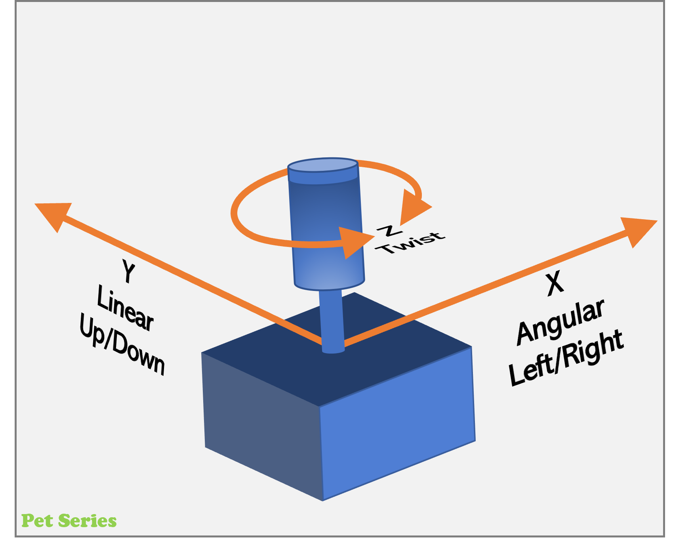
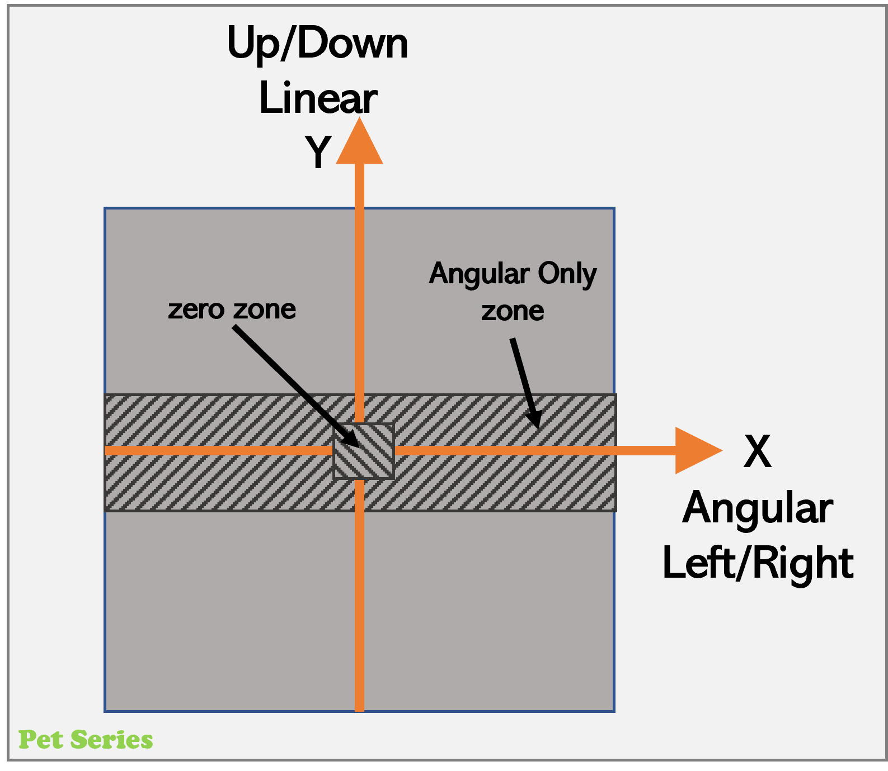
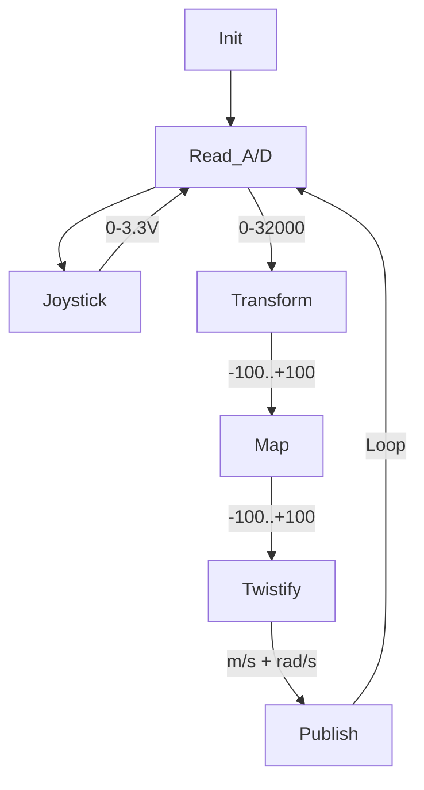
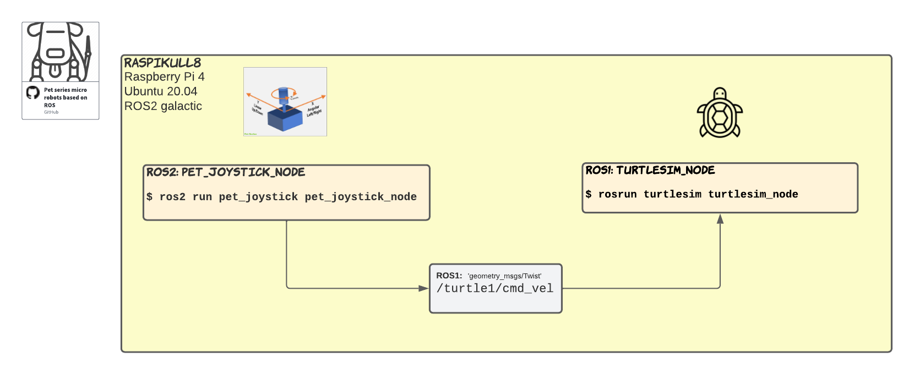
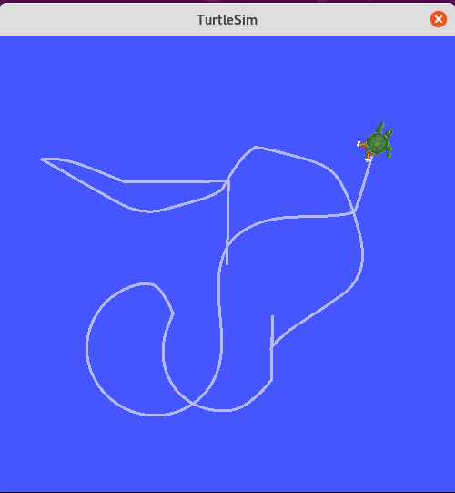
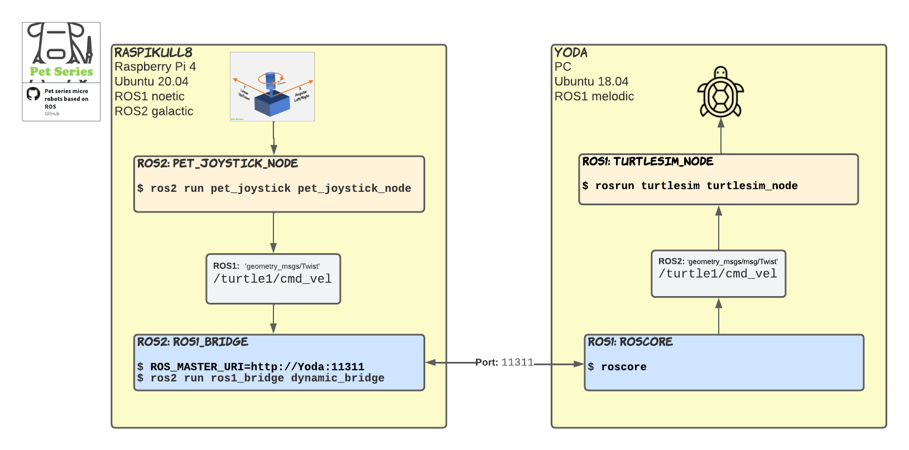

# ROS2 Python Joystick controller

Remotely control your robot via cmd_vel topic \
**Input:** 3x axis analog joystick (X + Y + Z/Twist) \
**Output:** micro-ROS node (ROS2) that publish topic /cmd_vel with msg.type twist_stamped
* `Angular` = `X-axis` = Pull stick Left/Right
* `Linear`  = `Y-axis` = Pull stick Up/Down
* `Twist`   = `Z-axis` = Turn/Twist stick  (Not used right now)

<table>
    <tr>
      <td>
        
      </td>
      <td>
        
      </td>
    </tr>
  </table>

## ROS2 Package/Module Behaviour
1. Once: Read/Set all the parameters
1. Repeatedly: Read analog joystick via ADC
1. Repeatedly: Transform indata to a +/-100% values
1. Repeatedly: Map where the stick are => Depending om location, then adjust behivaiur.
1. Repeatedly: Transform X, Y movment into Linear & Angaular according to twist msg.type
1. Repeatedly: Publish ros-topic



## Prerequisite: Hardware
* Single Board Computer(SBC): Raspberry Pi 3/4
* A/D converter: KY-053 Analog Digital Converter (ADS1115, 16-bit) via default I2C adr.=<code>0x48</code>
<ul><blockquote>🌐Google tips to find/order A/D-converter from eBay/AliExpress/Wish/Amazon/...  <br></ul>
1) "KY-053"<br>
2) "ADS1115 breakout board"
<table>
* Joystick: 3x analog 10K resistors. X-, Y- and Twist-axis.
<ul><blockquote>🌐Google tips to find/order Joystick from eBay/AliExpress/Wish/Amazon/...  <br>
1) "3-axis analog joy stick"<br>
2) "XYZ analog joystick"
<table>
  <tr>
    <td>
      
    </td>
    <td>
      .
    </td>
  </tr>
</table>

## Prerequisite: Software
* Ubuntu 20.04 (64bit) or newer
* Robot Operating System 2, ROS2 (Version Galathic)
  <blockquote>...do the ROS2-installation stuff...</blockquote>

## Prerequisite: I2C-interface Raspberry Pi 4 / Ubuntu
Prepared by adding additional, i2c communication, Linux-software-packages 
`Ubuntu Shell`
```
~$ sudo apt install i2c-tools
~$ sudo apt install python3-pip
~$ sudo pip3 install smbus2
~$ sudo pip3 install adafruit-ads1x15
~$ sudo i2cdetect -y 1
        0  1  2  3  4  5  6  7  8  9  a  b  c  d  e  f
   00:          -- -- -- -- -- -- -- -- -- -- -- -- -- 
   10: -- -- -- -- -- -- -- -- -- -- -- -- -- -- -- -- 
   20: -- -- -- -- -- -- -- -- -- -- -- -- -- -- -- -- 
   30: -- -- -- -- -- -- -- -- -- -- -- -- -- -- -- -- 
   40: -- -- -- -- -- -- -- -- 48 -- -- -- -- -- -- -- 
   50: -- -- -- -- -- -- -- -- -- -- -- -- -- -- -- -- 
   60: -- -- -- -- -- -- -- -- -- -- -- -- -- -- -- -- 
   70: -- -- -- -- -- -- -- --    
$ sudo chmod a+rw /dev/i2c-1
```

## Dowload and install this ROS2 packages
Create a ROS2 workspace (in my exampel '~/ws_ros2/') \
Dowload ROS2 package by using 'git clone'
<ul><blockquote>🤔There is probably better tutorials how to do this...<br/>
                ...but here is how I made it.<br/>
</blockquote></ul>

`Ubuntu Shell`
```
~$ mkdir -p ~/ws_ros2/src
~$ cd ~/ws_ros2/src
~/ws_ros2/src$ git clone https://github.com/Pet-Series/pet_joystick.git
~/ws_ros2/src$ cd ..
~/ws_ros2$ colcon build --symlink-install
~/ws_ros2$ source /opt/ros/galactic/setup.bash
~/ws_ros2$ source ./install/setup.bash
```

## ROS2 Launch sequence
`Ubuntu Shell`
```
~/ws_ros2$ ros2 run pet_joystick pet_joystick_node
  [INFO] [1645471061.181057770] [joystick_node]: joystick_node has started
  [INFO] [1645471061.183638877] [joystick_node]: - A/D: 0x48, X-chn: 3, Y-chn: 1, Twist-chn: 2
  [INFO] [1645471061.186369983] [joystick_node]: - A/D sampling: 10.0Hz, Topic: twist/cmd_vel
```

## ROS2 Topics used by this package
The <code>pet_joystick_node</code> parallel publishes three variants of topics messages.
1. <code>/raw/joystick</code> using msg.type Joy from sensor_msgs.msg
2. <code>/twist/cmd_vel</code> using msg.type Twist from geometry_msgs.msg
3. <code>/twist_stamped/cmd_vel</code> using msg.type TwistStamped from geometry_msgs.msg

`Ubuntu Shell`
```
~/ws_ros2$ ros2 topic list
  /raw/joystick
  /twist/cmd_vel
  /twist_stamped/cmd_vel
```

## ROS2 Parameters used by this package
Save a "dump" of all the parameters that <code>pet_joystick_node</code> uses.
`Ubuntu Shell`
```
~/ws_ros2$ ros2 param dump /joystick_node
  Saving to:  ./joystick_node.yaml
```
In the following list you can see all the parameters that <code>pet_joystick_node</code> uses. And their default values.<br>
`./joystick_node.yaml`

 ```Yaml
/joystick_node:
  ros__parameters:
    adc_i2c_address: '0x48'
    adc_x_channel: 3
    adc_y_channel: 1
    adc_z_channel: 2
    angular_only: 30
    angular_scaling: 0.01
    cycle_timer: 0.1
    cycles_publish: 10
    granularity: 5
    linear_scaling: 0.02
    ros_topic_raw: raw/joystick
    ros_topic_twist: twist/cmd_vel
    ros_topic_twist_stamped: twist_stamped/cmd_vel
    x_polarity: -1
    y_polarity: 1
    z_polarity: -1
    zero_range_max: 5
    zero_range_min: -5
```
</ul>
<br>

---

## ROS2 Test pet_joystick_node using TurtleSim
Objective is to control the simulated turtle on screen by using <code>pet_joystick_node</code>.
<ul><blockquote>🤔Most probably have you already the TurtleSim installed as a part of ROS2.<br>
                ...I will not cover that here!
</blockquote></ul>



Initiate ROS2 & launch TurtleSim<br>
<code>Ubuntu Shell #1</code>
```
~/ws_ros2$ source /opt/ros/galactic/setup.bash
~/ws_ros2$ ros2 run turtlesim turtlesim_node
```
Show/list used ros-topics that TurtleSim using and look for the "cmd_vel"<br>
<code>Ubuntu Shell #2</code>
```
~/ws_ros2$ ros2 topic list
	/turtle1/cmd_vel   <- This is the topic name that TurtleSim using.
	/turtle1/color_sensor
	/turtle1/pose
~/ws_ros2$
``` 

Set the output ros-topic name for the <code>pet_joystick_node</code> to match the topic-name that TurtleSim using = <code>/turtle1/cmd_vel</code><br>
One way to do this is set the parameter <code>-p ros_topic_twist:=turtle1/cmd_vel</code> when launching <code>pet_joystick_node</code><br>
<code>Ubuntu Shell #3</code>
```
~/ws_ros2$ ros2 run pet_joystick pet_joystick_node --ros-args -p ros_topic_twist:=turtle1/cmd_vel
  [INFO] [1645466678.951719930] [joystick_node]: joystick_node has started
  [INFO] [1645466678.954457277] [joystick_node]: - A/D: 0x48, X-chn: 3, Y-chn: 1, Twist-chn: 2
  [INFO] [1645466678.957577325] [joystick_node]: - A/D sampling: 10.0Hz, Topic: turtle1/cmd_vel
``` 
<ul></ul>

<br>

---

## ROS2 Test pet_joystick_node via ROS1_Bridge to TurtleSim on an other PC running ROS1
If the target system is based on ROS1 (some legasy robot...). Then this is how you bridge the ROS2 based Joystick_node over to a ROS1 based target system (in this example running TurtleSim under ROS1).
  
