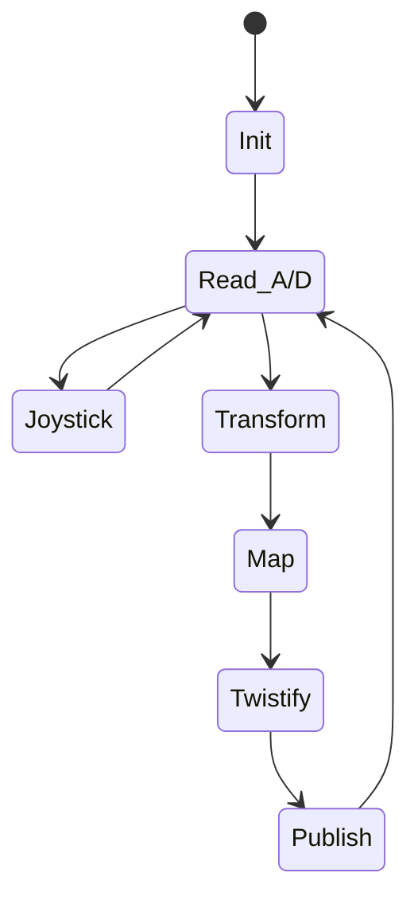
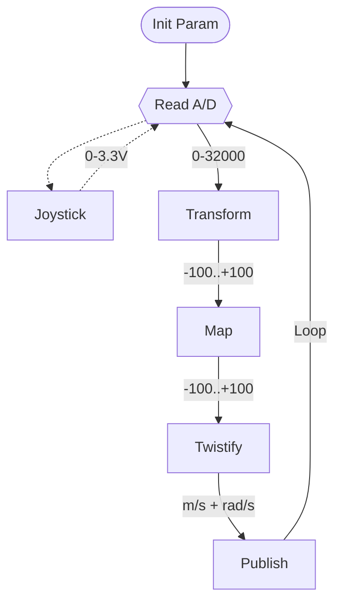
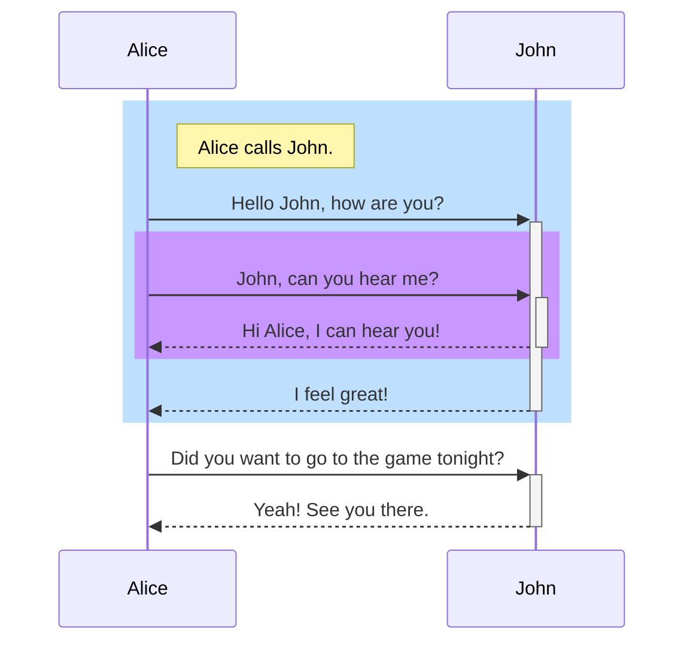
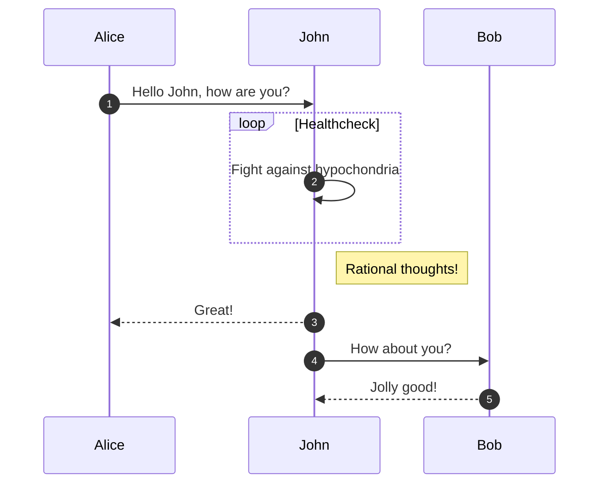
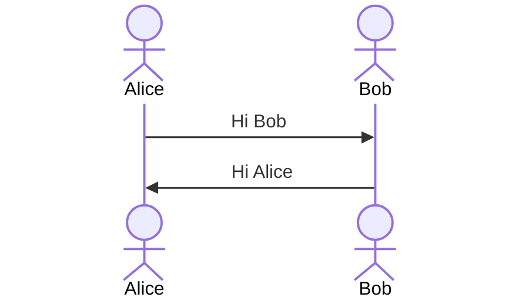

## Test of embedded mermaid diagrams in GitHub README.md
* https://github.com/mermaid-js/mermaid
* https://mermaid-js.github.io/mermaid/#/README
* https://mermaid-js.github.io/mermaid/#/Tutorials
* https://www.kubernetes.dev/blog/2021/12/01/improve-your-documentation-with-mermaid.js-diagrams/
* https://mermaid-js.github.io/mermaid-live-editor/
* https://github.blog/2022-02-14-include-diagrams-markdown-files-mermaid/











```mermaid
graph LR;
 client([client])-. Ingress-managed <br> load balancer .->ingress[Ingress];
 ingress-->|routing rule|service[Service];
 subgraph cluster
 ingress;
 service-->pod1[Pod];
 service-->pod2[Pod];
 end
 classDef plain fill:#ddd,stroke:#fff,stroke-width:4px,color:#000;
 classDef k8s fill:#326ce5,stroke:#fff,stroke-width:4px,color:#fff;
 classDef cluster fill:#fff,stroke:#bbb,stroke-width:2px,color:#326ce5;
 class ingress,service,pod1,pod2 k8s;
 class client plain;
 class cluster cluster;
 ```
